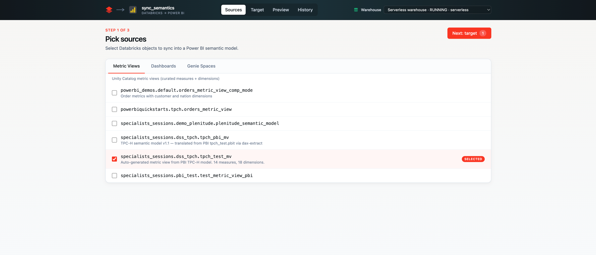
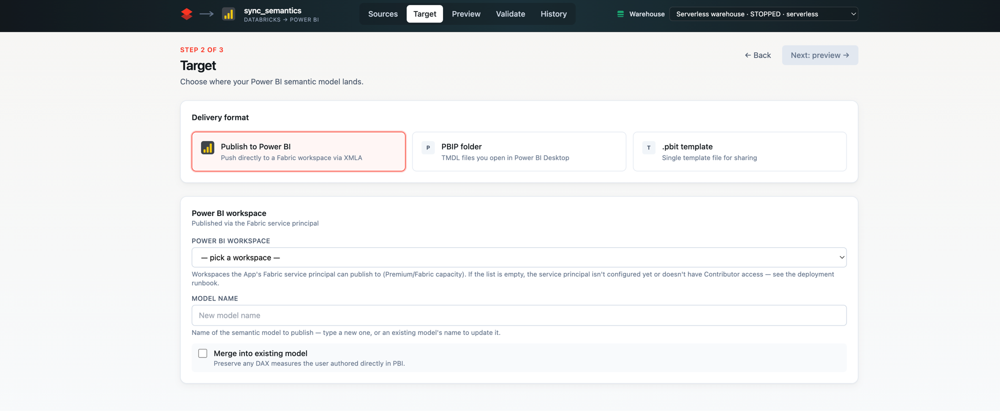
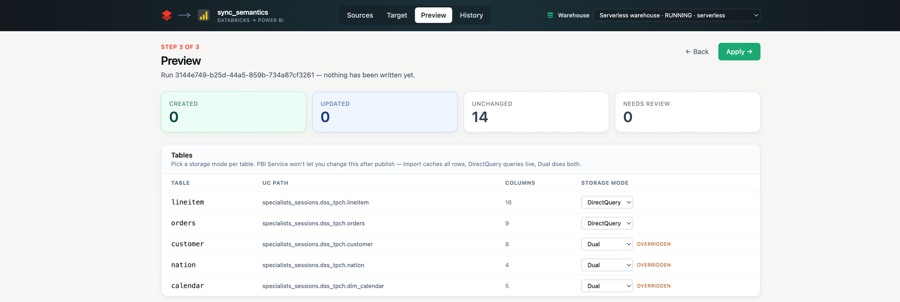
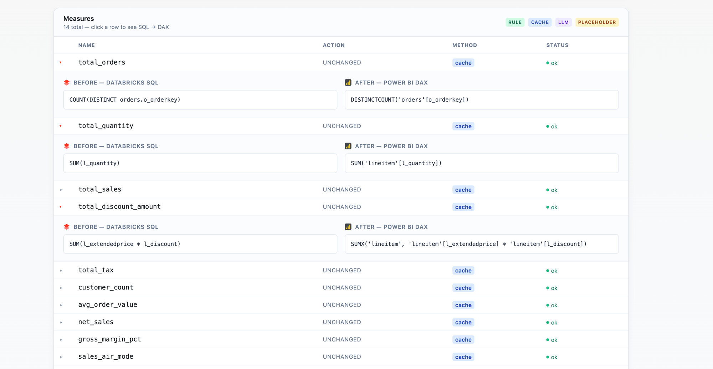
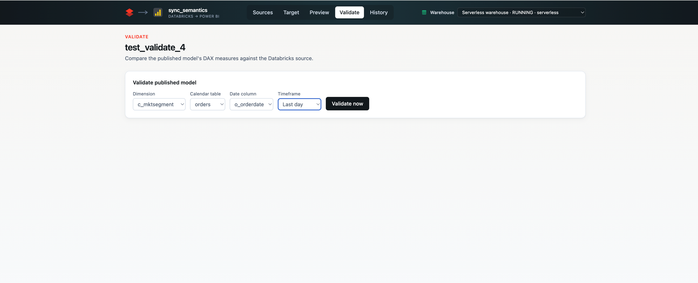
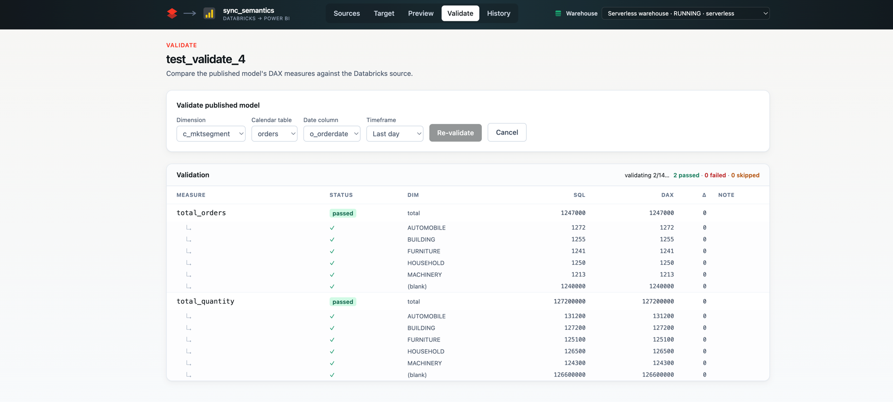
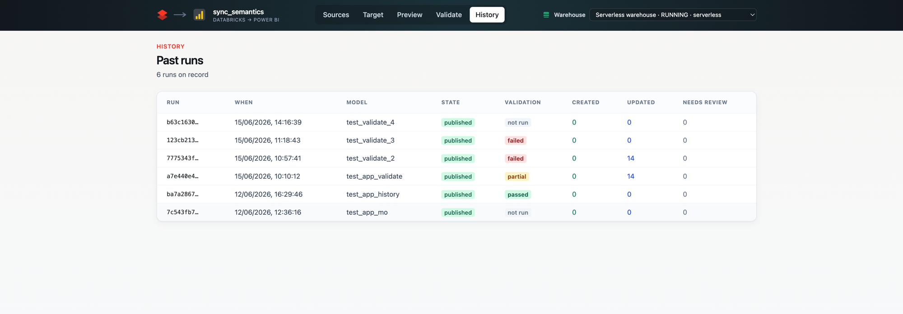

# sync_semantics

Sync the semantic layer in Databricks — Unity Catalog Metric Views, AI/BI (Lakeview) dashboards, and Genie spaces — into a **Power BI semantic model**. Ships as a hosted **Databricks App** with a guided web UI, and as a command-line tool.

---

> ## ⚠️ Disclaimer
>
> This is an **open-source project** provided **as-is**. It is **not an official Databricks product and is not supported, endorsed, or warranted by Databricks** in any way. No SLA, support channel, or guarantee is implied. You deploy and run it **at your own risk and responsibility** — review the code, test it against non-production data first, and validate the results before relying on them. You are solely responsible for the security, compliance, and operation of anything you deploy into your own workspace and tenant (including the service-principal credentials you create).

---

## What it does

BI teams maintain measures and relationships twice: once in Databricks (where the data lives) and again in Power BI (where the dashboards live). `sync_semantics` reads your Databricks semantic objects and emits a Power BI semantic model in three shapes:

- **Publish directly to a Fabric / Power BI workspace** (via the Fabric REST `semanticModels` API), with the Databricks connection already wired.
- **PBIP folder** (TMDL files) you open in Power BI Desktop.
- **`.pbit` template** — a single-file Power BI template.

SQL measures are translated to **DAX** by a deterministic rule engine, with an optional Anthropic Claude fallback for patterns the rules don't cover. After a publish, a built-in **Validate** step proves the numbers match by running each measure on both Databricks and the published Power BI model and comparing the results.

```
  Databricks                     sync_semantics                  Power BI
┌───────────────┐               ┌───────────────┐         ┌──────────────────┐
│ Metric View   │──────────────▶│  readers/     │         │  Publish via     │
│ Lakeview Dash │──────────────▶│  translator/  │────────▶│  Fabric REST API │
│ Genie space   │──────────────▶│  writers/     │         │  PBIP / .pbit    │
└───────────────┘               └───────────────┘         └──────────────────┘
                                  App UI · CLI
```

---

## Prerequisites

You deploy this into **your own** Databricks workspace and connect it to **your own** Microsoft Entra (Azure AD) service principal. Nothing is hardcoded and no credentials ship with this repo — you bring your own.

**On the machine you deploy from:**

| Tool | Why | Install |
|---|---|---|
| [Databricks CLI](https://docs.databricks.com/dev-tools/cli/install.html) **v0.218+** | Deploys the app bundle | `brew install databricks` (or see docs) |
| [`uv`](https://docs.astral.sh/uv/) | Python runtime/CLI usage (optional — only for the CLI; the App build runs `uv` automatically in your workspace) | `brew install uv` |
| `git` | Clone this repo | — |

> The pre-built web UI (`frontend/dist/`) is **committed to this branch**, so you do **not** need Node.js or `pnpm` to deploy. You only need them if you want to modify the UI (see [Modifying the UI](#modifying-the-ui)).

**In your Databricks workspace:**

- A **SQL warehouse** (the app runs your metric-view queries through it).
- Unity Catalog **Metric Views** (and/or AI/BI dashboards, Genie spaces) you want to migrate.
- Permission to deploy a [Databricks App](https://docs.databricks.com/dev-tools/databricks-apps/index.html) and create a secret scope.
- Outbound internet from the workspace to **public PyPI** (`pypi.org` / `files.pythonhosted.org`) — the App's build step installs Python dependencies from there. See [Using a private package registry](#using-a-private-package-registry) if you don't allow public PyPI.

**In Microsoft / Power BI:**

- A **Microsoft Entra app registration (service principal)** you control.
- **Power BI tenant admin** able to enable service-principal API access and XMLA endpoints.
- A target Power BI **workspace on Premium / Premium-Per-User / Fabric capacity** (XMLA write requires dedicated capacity).

---

## Deployment — step by step

Everything below uses a Databricks CLI **profile** (`-p <profile>`); the bundle pins **no host**, so the same config deploys to any workspace — only the profile and your secret values change.

### Step 1 — Clone and authenticate the Databricks CLI

```bash
git clone <this-repo-url> sync_semantics
cd sync_semantics

databricks auth login \
  --host https://<your-workspace-host> \
  --profile my-workspace
```

`<your-workspace-host>` is your workspace URL, e.g. `https://adb-1234567890.11.azuredatabricks.net` (Azure) or `https://dbc-xxxx.cloud.databricks.com` (AWS/GCP).

### Step 2 — Create and configure the Microsoft Entra service principal

The App authenticates to Power BI as a dedicated AAD service principal (a UC `POWER_BI` connection can't be used — its token is never exposed to the App).

1. In **Microsoft Entra ID → App registrations**, create a new registration (single tenant is fine). No API permissions need to be ticked — Power BI uses workspace roles + tenant settings as its access model.
2. Under **Certificates & secrets**, create a **client secret** and copy its **value** immediately.
3. Note three values: the **Application (client) ID**, the **secret value**, and your **Directory (tenant) ID**.
4. In the **Power BI admin portal → Tenant settings**:
   - Enable **"Service principals can use Fabric APIs"** (scope it to a security group that contains your SP).
   - Enable **"Allow XMLA endpoints and Analyze in Excel…"** → **Read/Write**.
5. For **each target Power BI workspace** → **Workspace access** → add the service principal as a **Contributor** (or Admin). The workspace must be on **Premium / PPU / Fabric capacity**.

### Step 3 — Store the SP credentials in a Databricks secret scope

The bundle reads these from a secret scope named **`dbx2pbi-fabric`** with three keys (names are referenced by `databricks.yml` — use these exact names, or edit the bundle to match your own):

```bash
databricks secrets create-scope dbx2pbi-fabric -p my-workspace

databricks secrets put-secret dbx2pbi-fabric fabric-sp-client-id     --string-value '<client-id>'    -p my-workspace
databricks secrets put-secret dbx2pbi-fabric fabric-sp-client-secret --string-value '<secret-value>' -p my-workspace
databricks secrets put-secret dbx2pbi-fabric fabric-tenant-id        --string-value '<tenant-id>'    -p my-workspace
```

### Step 4 — Deploy the bundle (creates the App + registers the secret refs)

```bash
databricks bundle deploy -p my-workspace
```

This creates the Databricks App named `databricks-to-pbi` and registers the three secret references and OBO scopes the App needs.

### Step 5 — Grant the App's service principal READ on the scope

`bundle deploy` auto-creates the App's own service principal. Grant it read access to the secret scope so `valueFrom:` can resolve at runtime. Get the App SP id, then put the ACL:

```bash
databricks apps get databricks-to-pbi -p my-workspace --output json   # find "service_principal_client_id"

databricks secrets put-acl dbx2pbi-fabric <app-sp-client-id> READ -p my-workspace
```

### Step 6 — Deploy the App source code

```bash
SOURCE_PATH="/Workspace/Users/<your-email>/.bundle/databricks-to-pbi/dev/files"
databricks apps deploy databricks-to-pbi --source-code-path "$SOURCE_PATH" -p my-workspace
```

This uploads the code, installs Python dependencies from public PyPI (using the committed `uv.lock`), and starts the App.

### Step 7 — Open the App

`apps deploy` prints the App URL. Open it in an **incognito window** so the first-login OAuth consent prompt triggers cleanly. The first user to open the App approves the on-behalf-of (OBO) scopes it requests (`sql`, `dashboards.genie`, `catalog.connections`).

### Using a private package registry

This repo's `uv.lock` resolves all Python dependencies from **public PyPI**. If your organization installs Python packages from a **private mirror, proxy, or internal index** (Artifactory, Nexus, a corporate PyPI proxy, etc.) instead of `pypi.org`, configure that index **and regenerate the lockfile before deploying** — otherwise the App's build step (`uv sync`) will try to reach a registry your network may block.

1. Declare your index in `pyproject.toml`:

   ```toml
   [[tool.uv.index]]
   name = "my-private-index"
   url = "https://<your-registry-host>/simple"
   default = true
   ```

   (Or set `UV_INDEX_URL=https://<your-registry-host>/simple` in your shell instead of editing the file.)

2. Regenerate the lockfile so it points at your registry:

   ```bash
   uv lock
   ```

3. Commit the updated `uv.lock` (and `pyproject.toml`) before running `databricks bundle deploy`.

> Re-run `uv lock` **whenever** you change dependencies or your registry, so the committed lockfile and your environment stay in sync. The same applies to the frontend if you build it — `pnpm` reads your `~/.npmrc`/registry settings.

### Redeploying after changes

After the one-time setup, redeploying code is just steps 4 and 6:

```bash
databricks bundle deploy -p my-workspace
databricks apps deploy databricks-to-pbi --source-code-path "$SOURCE_PATH" -p my-workspace
```

---

## Usage — the App

The App is a wizard: **Sources → Target → Preview → Validate → History**. A **↻ New sync** button in the header clears your selections and the translation cache to start a fresh migration.

### 1. Pick sources

Choose Unity Catalog metric views, AI/BI dashboards, and Genie spaces from one picker. The **SQL warehouse** is selected once from the header and persists across the flow.



### 2. Choose a target

- **Publish to Power BI** (default) — pick a workspace from the dropdown (only Premium/Fabric-capacity workspaces the SP can publish to are listed). The model is created via the Fabric REST API with its Databricks data-source connection already wired.
- **PBIP folder** — TMDL files, streamed back as a `.zip`.
- **`.pbit` template** — single-file template, streamed back.



### 3. Preview the translation

**Tables** — every UC-backed table with a storage-mode picker (DirectQuery / Dual / Import). Power BI Service won't let you change storage mode after publish, so this is your one chance to pin large fact tables to DirectQuery and small dimensions to Dual/Import. An `OVERRIDDEN` badge marks tables you've changed from the default.



**Measures** — each measure with its source SQL on the left and the translated DAX on the right. A **Method** chip shows how each was translated: `rule` (deterministic), `cache` (reused), `llm` (Claude fallback), or `placeholder` (needs manual review). Click a row to expand the diff. Use the **Sync** checkbox to exclude a measure from the published model (your choices persist in the URL). Nothing is written until you click **Apply**.



### 4. Validate — prove the numbers match

After a **Publish to Power BI** delivery succeeds, the **Validate** tab lets you choose a **dimension** to break out by and a **timeframe** (all data, or the last day/week/month/quarter/year). **Validate now** runs an async job: for each measure it runs the source query on Databricks *and* the translated DAX against the live published model (via the Power BI `executeQueries` API), then compares — at the grand total and per dimension. Each measure lands as:

- **passed** — DAX returns the same number Databricks computes (within a relative tolerance, default `1e-6`).
- **failed** — a value is outside tolerance (the panel shows SQL value, DAX value, and delta).
- **skipped** — couldn't validate (a `placeholder` measure, a non-metric-view source, the source query exceeded the per-measure time budget, or the dataset's Databricks credentials aren't authorized in Power BI yet — see [Troubleshooting](#troubleshooting)).

Validation is a confidence check only — it never rolls back a completed publish. The tab is resumable: selections and the running job persist in the URL.




### 5. History — every migration on record

Each Apply writes one row to a Unity Catalog Delta table named `run_history`, created in the **same catalog and schema as the migrated source** (so it inherits that namespace's governance). It records state, translation counts by method, and the validation verdict. Click any run to open its detail view — where you can re-validate — or open a printable **migration confidence report**. Queries run as the signed-in user (OBO), so that user needs `USE CATALOG` on the source catalog and `CREATE TABLE`/`MODIFY` on its schema.



---

## Usage — the CLI

The same engine is available as a CLI for scripted/batch runs. Install dependencies once with `uv sync`, then:

```bash
# Single source → PBIP folder
uv run databricks-to-pbi sync \
  --metric-view main.sales.orders_mv \
  --warehouse-id <wh-id> \
  --model-name Sales \
  --target-pbip ./out/SalesModel \
  --uc-volume /Volumes/main/dbx2pbi/state \
  --apply
```

```bash
# Multi-source merge → publish to Power BI
uv run databricks-to-pbi sync \
  --metric-view main.sales.orders_mv \
  --dashboard dash-abc-123 \
  --genie-space space-xyz-789 \
  --warehouse-id <wh-id> \
  --model-name CombinedSales \
  --target-xmla <workspace-guid> \
  --uc-volume /Volumes/main/dbx2pbi/state \
  --apply --validate
```

- Delivery flags: `--target-pbip ./out/Model` · `--target-pbit ./out/Model.pbit` · `--target-xmla <workspace-guid>` (publish; the flag name is kept for backwards-compat but the writer is the Fabric REST API).
- Merge precedence on collisions: Metric View > Dashboard > Genie space.
- For `--target-xmla`, set the same SP credentials the App uses, as environment variables:

  ```bash
  export FABRIC_SP_CLIENT_ID=...
  export FABRIC_SP_CLIENT_SECRET=...
  export FABRIC_TENANT_ID=...
  ```

Every run also writes a sync report (`.html`, `.md`, `.json`) under `<uc-volume>/reports/<run-id>.*`.

---

## Configuration reference

All runtime configuration lives in `app.yaml` (env vars) and `databricks.yml` (bundle resources). Defaults work out of the box; override only if you need to.

| Variable | Default | Purpose |
|---|---|---|
| `DBX2PBI_UC_VOLUME` | `/tmp/dbx2pbi/state` | Where manifests, reports, and caches live. `/tmp` is fine for the App's in-memory lifetime; point it at a real UC volume (e.g. `/Volumes/<catalog>/<schema>/state`) once the App SP has `WRITE_VOLUME` for persistence across restarts. |
| `DBX2PBI_FRONTEND_DIST` | `frontend/dist` | Location of the built UI (committed to this branch). |
| `FABRIC_SP_CLIENT_ID` / `FABRIC_SP_CLIENT_SECRET` / `FABRIC_TENANT_ID` | from secret scope `dbx2pbi-fabric` | Power BI service-principal credentials (Steps 2–3). Without these, the publish/validate features are disabled and the UI shows a clear tooltip; PBIP/`.pbit` export still works. |
| `ANTHROPIC_API_KEY` | unset (optional) | Enables the Claude DAX-translation fallback for patterns the rule engine doesn't cover. When unset, untranslatable measures get a `// MANUAL:` placeholder and are flagged in the report. Wire it via a secret if you use it. |

**OBO scopes** the App requests from each user (set in both `app.yaml` and `databricks.yml`): `sql`, `dashboards.genie`, `catalog.connections`. Lakeview (AI/BI) dashboard discovery has no public OBO scope yet, so that endpoint may return `403` until Databricks exposes one — metric views and Genie spaces are unaffected.

---

## SQL → DAX translation

The rule engine covers most patterns with no LLM call:

| SQL | DAX |
|---|---|
| `SUM(amount)` | `SUM('Orders'[amount])` |
| `AVG(amount)` | `AVERAGE('Orders'[amount])` |
| `COUNT(*)` / `COUNT(DISTINCT id)` | `COUNTROWS('Orders')` / `DISTINCTCOUNT('Orders'[id])` |
| `SUM(a) / SUM(b)` | `DIVIDE(SUM(...), SUM(...))` |
| `SUM(CASE WHEN status='X' THEN amount END)` | `CALCULATE(SUM(...), 'Orders'[status] = "X")` |
| `SUM(a*b) / SUM(b)` (weighted avg) | `DIVIDE(SUMX('t', 't'[a]*'t'[b]), SUM('t'[b]))` |
| `SUM(CASE WHEN … THEN … WHEN … ELSE … END)` | `SUMX('t', SWITCH(TRUE(), …))` |
| `SUM(amount) OVER (PARTITION BY region)` | `CALCULATE(SUM('t'[amount]), ALLEXCEPT('t','t'[region]))` |
| `... WHERE col LIKE 'foo%'` | `STARTSWITH('Orders'[col], "foo")` |

Patterns the rules don't cover (complex CASE chains, mixed arithmetic, some window functions) fall back to Claude when `ANTHROPIC_API_KEY` is set, or emit a `// MANUAL:` placeholder otherwise.

---

## Troubleshooting

| Symptom | Cause / fix |
|---|---|
| Validation says **skipped: credentials not authorized** | A published dataset's Databricks credentials must be signed in once, interactively, in the Power BI Service: open the dataset → **Settings → Data source credentials → Edit credentials**, sign in, then re-validate. No public API can set these (intentional Power BI guardrail). |
| `GET /api/fabric/workspaces` returns **fabric_sp_not_configured** | The `dbx2pbi-fabric` secret scope isn't set up, or the App SP lacks READ on it (Steps 3 & 5). |
| Workspace dropdown is **empty** | The SP isn't a Contributor on any Premium/Fabric-capacity workspace, or "Service principals can use Fabric APIs" isn't enabled (Step 2). |
| Publish fails with an **XMLA / capacity** error | The target workspace isn't on dedicated (Premium/PPU/Fabric) capacity, or XMLA Read/Write isn't enabled in the tenant settings. |
| AI/BI dashboard discovery returns **403** | Lakeview has no public OBO scope yet; use metric views / Genie spaces, or wait for Databricks to expose the scope. |
| App build fails fetching dependencies | The workspace needs outbound internet to public PyPI; check your workspace's egress/firewall settings. |

---

## Modifying the UI

The built UI is committed, so this is only needed if you change the React frontend.

```bash
cd frontend
pnpm install
pnpm build        # regenerates frontend/dist/ — commit it before redeploying
```

Local dev with hot reload:

```bash
# Terminal 1 — backend
export DBX2PBI_UC_VOLUME=/tmp/dbx2pbi
export DBX2PBI_WAREHOUSE_ID=<wh-id>
uv run uvicorn databricks_to_pbi.app.main:app --reload

# Terminal 2 — frontend (proxies /api to the backend on :8000)
cd frontend && pnpm dev      # http://localhost:5173
```

Run the test suites:

```bash
uv run pytest -q
uv run ruff check src tests
uv run mypy src tests
cd frontend && pnpm test
```

---

## Limitations

- Setting a published dataset's Databricks credentials is a one-time interactive step in the Power BI Service — no public API can do it.
- Power BI Service does not allow changing a table's storage mode after publish — set it in the Preview step.
- Window functions, subqueries, and cross-table CTEs in measure SQL emit `// MANUAL:` placeholders unless the Claude fallback is enabled.
- Lakeview / Genie reader coverage is validated against representative fixtures; verify edge cases against your own objects.
